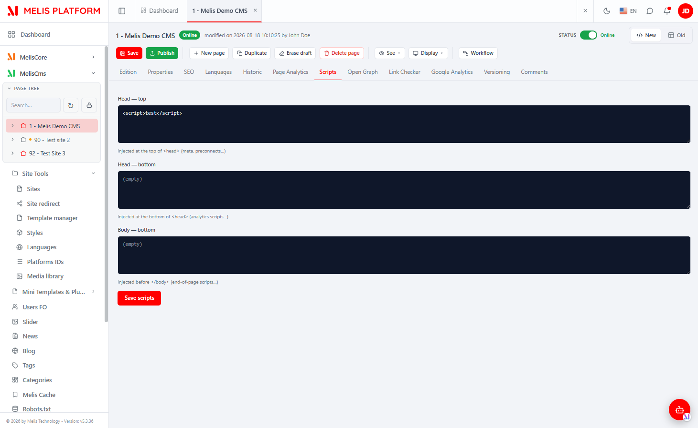
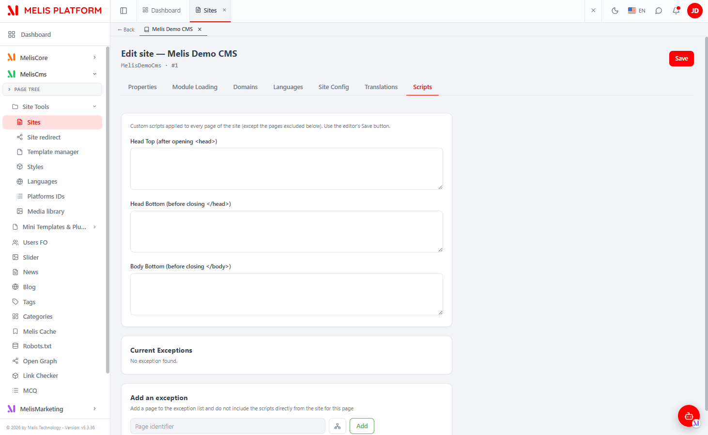

# MelisCmsPageScriptEditor (React back-office) — Functional & Technical Documentation (for AI)

> **What this is.** MelisCmsPageScriptEditor lets you add **custom `<script>`/`<style>`/HTML**
> (analytics tags, tracking pixels, third-party widgets) that get **injected automatically into a
> page's rendered HTML** — at the **top of `<head>`**, the **bottom of `<head>`**, or the **bottom of
> `<body>`** — scoped to a **whole site** or a **single page**. This document covers it **in the new
> React back-office** (`/melis-react`). The module ships a **contribution-only brick** (no left-menu
> tool of its own): it adds a **Scripts tab in two places** — the **CMS page editor** (per-page
> scripts) and the **Sites tool edition** (per-site scripts + exceptions). Both tabs are **native
> React** and call **this module's** JSON endpoints. For the underlying data model, services, render
> listeners and view helper, see the [legacy doc](./MelisCmsPageScriptEditor.md); this doc does not
> repeat them.
>
> **How this document is organised — two clearly separated parts:**
> - **[Part A — Functional Guide](#part-a--functional-guide)** — for everyday users (and the chat
>   assistant) using the React back-office. Plain language.
> - **[Part B — Technical Reference](#part-b--technical-reference)** — for developers and AI building
>   inside the React UI, with code (brick manifest, tab registrations, endpoints, capabilities).
>
> **Audience**: consumed by the **MelisAI** MCP. **Status**: reviewed 2026-08-19.

---

## 0. Where this lives in the React back-office — read this first

- **Brick kind: contribution-only brick** (no menu tool, no route). The manifest carries
  `route:null`, `forwardKey:null`, `melisKey:null` (id `cms-page-script-editor`, `entry:"brick.js"`),
  so the host loads the bundle **at boot** as a widget and the tab self-registers early — there is
  **no `/melis-react` left-menu node** for this module.
- **Two surfaces, two different tab registries — both native React:**
  1. A **Scripts tab in the CMS page editor** (MelisCms → open a **page** → the **Scripts** tab).
     Sets the **per-page** scripts (Head top / Head bottom / Body bottom), with its own **Save
     scripts** button. **The React component for this page tab lives in MelisCms** (`PageTabs.tsx`,
     keyed `meliscms_page_script_editor`); this module supplies the **react-api endpoints** and the
     **capability declaration** it calls.
  2. A **Scripts tab in the Sites tool edition** (MelisCms → **Sites** → open a site → the **Scripts**
     tab). Sets the **site-wide** scripts **plus** the **exceptions list** (pages that opt out of the
     site scripts). **The React component for this site tab lives in THIS module** (`ScriptsTab.tsx`),
     registered via the generic `window.__melisSiteTabs` registry, and saved by the **site editor's
     global Save** button.
- **Activation-gated.** Both tabs appear **only if the module is active** (discovered via
  `GET /melis/react-api/react-modules`, then the bundle is prefetched). The **page-tab button** also
  requires the capability declared under `meliscms_page` (see §B4) — without it the CMS-page caps
  whitelist hides the button even for an admin.
- **Turn injection on per site.** As in the legacy tool, scripts are only injected on the front once
  the module is **loaded on that site** (Sites → Module loading). Editing scripts in the back-office
  does nothing on the front until then. See the [legacy doc §A1](./MelisCmsPageScriptEditor.md).

---
---

# PART A — Functional Guide

## A1. What you can do with MelisCmsPageScriptEditor in the new back-office

- **Add code without editing templates** — paste an analytics snippet, a chat widget, a custom style,
  and it appears on the live pages.
- **Choose where it goes** — three slots: **Head top** (right after `<head>`), **Head bottom** (just
  before `</head>`), **Body bottom** (just before `</body>`).
- **Scope it** — apply scripts to the **whole site** (Sites tool → Scripts tab), or to a **single
  page** (page editor → Scripts tab).
- **Make exceptions** — let specific pages **opt out** of the site-wide scripts, and see the full
  **exceptions list** from the site's Scripts tab.

## A2. Finding it in /melis-react

There is **no dedicated left-menu tool** — the Scripts tab lives inside two existing tools.

**Per page** (this page's scripts): left sidebar → **MelisCms** → open a **page** → the **Scripts**
tab in the page editor's tab row.


*The React CMS page editor with page "1 - Melis Demo CMS" open and the **Scripts** tab active: three
dark code editors — **Head — top** ("Injected at the top of `<head>`", here holding `<script>test</script>`),
**Head — bottom** ("Injected at the bottom of `<head>`", empty) and **Body — bottom** ("Injected before
`</body>`", empty) — and a red **Save scripts** button. These scripts apply to **this page only**.*

**Per site** (site-wide scripts + exceptions): left sidebar → **MelisCms** → **Sites** → open a site →
the **Scripts** tab.


*The React **Sites** edition ("Edit site — Melis Demo CMS · #1") with the **Scripts** tab active: an
intro line "Custom scripts applied to every page of the site (except the pages excluded below). Use the
editor's Save button.", the three site-wide textareas (**Head Top** / **Head Bottom** / **Body Bottom**),
a **Current Exceptions** card ("No exception found.") and an **Add an exception** block (a "Page
identifier" input, a page-tree picker button and an **Add** button). The site scripts are saved by the
site editor's top-right **Save** button.*

## A3. Key words explained

- **Head top / Head bottom / Body bottom** — the three injection slots (after `<head>`, before
  `</head>`, before `</body>`).
- **Site scripts vs page scripts** — site scripts apply to every page; page scripts apply to one page.
  On a served page you get **site scripts first, then the page's own scripts** in each slot — **unless**
  the page is an exception.
- **Exception** — a page that **opts out** of the site-wide scripts (only its own page scripts are
  injected). You add/remove exceptions from the **site's** Scripts tab.
- **Page tab vs Site tab** — the same idea in two tools: the **page tab** edits one page (own Save
  scripts button); the **site tab** edits the site + manages exceptions (saved by the editor's global
  Save).

> For the full injection rules and the render listeners, see the
> [legacy doc §A3 / §B4](./MelisCmsPageScriptEditor.md).

## A4. The page-editor Scripts tab (per page)

Open a page → **Scripts** tab. You get the three code editors (Head top / Head bottom / Body bottom)
for **this page only**, each with a one-line hint of where it is injected. Click **Save scripts** to
persist. This tab has **no site-wide view and no exceptions list** — it only edits the current page.

## A5. The Sites tool Scripts tab (per site + exceptions)

Sites → open a site → **Scripts** tab. Three blocks:

1. **Site scripts** — the three site-wide editors (Head Top / Head Bottom / Body Bottom). They have
   **no Save button of their own**: they are saved by the site editor's **global Save** (top-right).
2. **Current Exceptions** — the list of pages that opted out of the site scripts ("No exception found."
   when empty). Each row has a **Remove** action (with a confirmation dialog).
3. **Add an exception** — type a **page identifier** (or pick a page from the **page-tree** picker
   button) and click **Add**. The page must belong to this site; a page already excepted can't be
   added twice.

## A6. Common tasks — "How do I…?"

- **Add analytics to a whole site** → Sites → open the site → **Scripts** tab → paste the snippet in
  **Head Bottom** → the site editor's **Save** (and make sure the module is loaded on the site).
- **Add a one-off script to a single page** → open the page → **Scripts** tab → paste it → **Save scripts**.
- **Stop the site scripts on one page** → Sites → the site's **Scripts** tab → **Add an exception** →
  enter/pick that page → **Add**.
- **See which pages excluded the site scripts** → Sites → the site's **Scripts** tab → **Current
  Exceptions** list.
- **Remove an exception** → the exception's **Remove** button → confirm.

---
---

# PART B — Technical Reference

## B1. React presence at a glance

| Item | Value |
|---|---|
| Brick kind | **Contribution-only brick** (no menu tool / no route; adds two tabs) — with a `react-api.php` for the page tab and a module JSON controller for the site tab |
| Brick id | `cms-page-script-editor` |
| Manifest `route` / `forwardKey` / `melisKey` | **all `null`** (loaded at boot as a widget) |
| `label` | `Page Script Editor` (manifest label; not shown as a menu entry) |
| `entry` | `brick.js` |
| Site-tab registry key | `scripts` (pushed onto `window.__melisSiteTabs`, `order: 55`) |
| Page-tab registry key (= its capability) | `meliscms_page_script_editor` (component registered by **MelisCms**, keyed here) |
| Capabilities host node | `meliscms_page` (shared with the CMS page tool; `tabs[]` merge) |
| Page-tab API base (this module) | `/melis/react-api/cms-page/scripts` (+ `/scripts/save`) — `MelisReactApiPageScriptEditorController` |
| Site-tab API base (this module) | `/melis/MelisCmsPageScriptEditor/MelisCmsPageScriptEditorReact/…` — `MelisCmsPageScriptEditorReactController` |
| Page-tree picker (reused legacy) | `GET /melis/MelisCms/TreeSites/get-tree-pages-by-page-id?nodeId=<id>` |
| Tables (owned) | `melis_cms_scripts`, `melis_cms_scripts_exceptions` — see [legacy doc §B2](./MelisCmsPageScriptEditor.md) |
| Service (business logic) | `MelisCmsPageScriptEditorService` — [legacy doc §B3](./MelisCmsPageScriptEditor.md) |
| Activation-gated | Yes (discovered via `GET /melis/react-api/react-modules`) |
| Composer deps | `melis-core ^6.0`, `melis-cms ^6.0`, PHP `^8.3|^8.5` |

## B2. The brick — anatomy

Source in `ui-react/` (Vite **IIFE**, React externalised to the host globals `MelisReact*`, output to
`public/ui-react/brick.js` next to `brick.manifest.json` — see `ui-react/vite.config.ts`). It is a
**contribution-only** bundle: it registers a tab, it does **not** call `__melisRegisterBrick` (there is
no routed page).

Manifest (`public/ui-react/brick.manifest.json`) — a **single-brick, id-only** shape (no
route/forwardKey/melisKey ⇒ a widget-only bundle evaluated at boot):
```json
{ "id": "cms-page-script-editor", "route": null, "label": "Page Script Editor",
  "forwardKey": null, "melisKey": null, "entry": "brick.js" }
```

`ui-react/src/brick.tsx` registers **one site tab** into the generic **`window.__melisSiteTabs`**
registry (contract owned by the MelisCms Site editor) — and dispatches an event so already-mounted
Site editors refresh:
```tsx
import ScriptsTab from './ScriptsTab'
function registerSiteTab(tab) {                    // idempotent (replace-by-id) + event
  const list = (window.__melisSiteTabs ??= [])
  const i = list.findIndex((t) => t.id === tab.id)
  if (i >= 0) list[i] = tab; else list.push(tab)
  window.dispatchEvent(new CustomEvent('melis:site-tabs-changed'))
}
registerSiteTab({ id: 'scripts', label: { fr: 'Scripts', en: 'Scripts' }, order: 55, Component: ScriptsTab })
```

React components:

| File | Owner module | Role |
|---|---|---|
| `ui-react/src/brick.tsx` | **this module** | Registration only: pushes the **site tab** `{ id:'scripts', order:55, Component: ScriptsTab }` onto `window.__melisSiteTabs`. No routed brick. |
| `ui-react/src/ScriptsTab.tsx` | **this module** | The **Sites-tool** Scripts tab. Props `{ siteId, registerSave }`. Three site-script textareas (**no own Save** — hooks into the site editor's global Save via `registerSave`), a **Current Exceptions** list (Remove + confirm dialog), an **Add an exception** block (page-id input + `TreeNode` page-tree picker). Calls `site-scripts-api.ts`. In-file `{fr,en}` i18n from `document.documentElement.lang`; inline styles (host theme CSS vars). |
| `ui-react/src/site-scripts-api.ts` | **this module** | API client for the **site** tab → `/melis/MelisCmsPageScriptEditor/MelisCmsPageScriptEditorReact/*` (see §B3), `{success,data,error}` contract, `X-Requested-With: XMLHttpRequest` + `credentials:'include'`. |
| `ui-react/src/cms-tree-api.ts` | **this module** | Page-tree client for the exception picker → reuses the legacy `GET /melis/MelisCms/TreeSites/get-tree-pages-by-page-id?nodeId=<id>` (`nodeId=-1` → roots; `<pageId>` → children). |
| `ui-react/src/shared/melis-form-errors.tsx` | **this module** | `FormErrorBanner`/`koNotify` helpers for add-exception validation. |
| `ScriptsTab` in `melis-cms/ui-react/src/PageTabs.tsx` | **MelisCms** | The **page-editor** Scripts tab (NOT in this module). Props `{ idPage }`; three code editors + its own **Save scripts** button; `apiGet('scripts?idPage=…')` / `apiPost('scripts/save', …)` against **this module's** react-api (§B3). Registered in MelisCms's `SELF_TABS` under key `meliscms_page_script_editor`. |

> **Brick constraint:** the bundle externalises only `react`/`react-dom`/`react/jsx-runtime`/
> `react-router-dom` to host globals; it can't import host modules (Tailwind/shadcn/lucide/i18n), hence
> inline styles + in-file i18n. Because React is shared, hooks/state work across the bundle boundary
> (the site tab renders inside the MelisCms Site-editor bundle).

## B3. React API — endpoints

Two distinct controllers, both **owned by this module** and both reusing
`MelisCmsPageScriptEditorService` for the real logic (legacy parity). Contract `{ success, data, error }`,
`X-Requested-With: XMLHttpRequest`, `credentials:'include'`.

### B3.1 Page-tab endpoints — `MelisReactApiPageScriptEditorController`

Routes in **`config/react-api.php`** (merged via `Module::getConfig()`), controller
`MelisCmsPageScriptEditor\Controller\MelisReactApiPageScriptEditorController` (invokable
`MelisReactApiPageScriptEditor`). Guarded by `denyUnlessAccess()` → auth + `MelisCoreRights::canAccess('meliscms_page_script_editor')`.

| Method & URL | Action | Purpose |
|---|---|---|
| `GET /melis/react-api/cms-page/scripts?idPage=<id>` | `get` | The page's scripts → `{ idPage, headTop, headBottom, bodyBottom, editDate }` |
| `POST /melis/react-api/cms-page/scripts/save` | `save` | Save the page's scripts (`{idPage, headTop, headBottom, bodyBottom}`; UPDATE latest `melis_cms_scripts` row for the page, else INSERT) → `{ idPage, editDate }` |

Example (from MelisCms `PageTabs.tsx` `ScriptsTab`, `apiGet`/`apiPost` base already `…/cms-page/`):
```ts
// GET a page's scripts
await apiGet<Scripts>(`scripts?idPage=${idPage}`)          // → { headTop, headBottom, bodyBottom }
// Save a page's scripts
await apiPost('scripts/save', { idPage, headTop, headBottom, bodyBottom })
```

> **Security note.** These endpoints inject custom `<script>`/HTML into the **public** front rendering
> of a page, so `get`/`save` require the **page-script-editor tool right** (`meliscms_page_script_editor`),
> not merely a session — a hardening fix so no zero-rights BO user could plant persistent XSS. The
> writes use parameterised SQL directly on `melis_cms_scripts`.

### B3.2 Site-tab endpoints — `MelisCmsPageScriptEditorReactController`

The generic module route `/melis/MelisCmsPageScriptEditor/:controller/:action` (in
`config/module.config.php`) exposes controller `MelisCmsPageScriptEditorReactController`. Guarded by
`denyUnlessAccess()` → auth + `MelisCoreRights::canAccess('meliscms_tool_sites')` (the tab lives inside
the **Sites** tool). All actions delegate to `MelisCmsPageScriptEditorService`.

| Method & URL | Action | Purpose |
|---|---|---|
| `GET /melis/MelisCmsPageScriptEditor/MelisCmsPageScriptEditorReact/site-script?siteId=<id>` | `siteScript` | Site scripts + exception count → `{ siteId, script:{id,headTop,headBottom,bodyBottom}\|null, exceptionCount }` |
| `POST /melis/MelisCmsPageScriptEditor/MelisCmsPageScriptEditorReact/save-site-script` | `saveSiteScript` | Save site scripts (`{siteId, id?, headTop, headBottom, bodyBottom}`; all-empty ⇒ deletes the entry, legacy parity) |
| `GET /melis/MelisCmsPageScriptEditor/MelisCmsPageScriptEditorReact/exceptions?siteId=<id>` | `exceptions` | The exceptions of a site → `{ items:[{id,pageId,pageName}], total }` |
| `POST /melis/MelisCmsPageScriptEditor/MelisCmsPageScriptEditorReact/add-exception` | `addException` | Add an exception (`{siteId, pageId}`; enforces "page belongs to this site" + no duplicate) |
| `POST /melis/MelisCmsPageScriptEditor/MelisCmsPageScriptEditorReact/delete-exception` | `deleteException` | Remove an exception (`{id}`) |

Example (from `site-scripts-api.ts`, base `/melis/MelisCmsPageScriptEditor/MelisCmsPageScriptEditorReact`):
```ts
const BASE = '/melis/MelisCmsPageScriptEditor/MelisCmsPageScriptEditorReact'
await apiFetch<SiteScriptResult>(`${BASE}/site-script?siteId=${siteId}`)              // load
await apiFetch<null>(`${BASE}/save-site-script`, { method: 'POST',                    // save (global Save)
  headers: { 'Content-Type': 'application/json' },
  body: JSON.stringify({ siteId, id: scriptId, headTop, headBottom, bodyBottom }) })
await apiFetch<null>(`${BASE}/add-exception`, { method: 'POST',                       // add exception
  headers: { 'Content-Type': 'application/json' }, body: JSON.stringify({ siteId, pageId }) })
```

> The site tab **does not** save itself: `ScriptsTab.registerSave(fn)` hooks its `saveSiteScript` call
> into the Site editor's **global Save** button; exceptions (add/delete) are **autonomous** (persisted
> immediately). Server-side logic (save rules, exception "same-site" guard, empty-clears-entry) is in
> `MelisCmsPageScriptEditorService` — see the [legacy doc §B3](./MelisCmsPageScriptEditor.md).

## B4. Capabilities (advanced rights)

Declared in **`config/react.capabilities.php`**, merged by `Module::getConfig()`
(`ArrayUtils::merge`). Because the module contributes a **tab to the CMS page tool**, it declares its
capability under the **shared** rights-bearing node **`meliscms_page`** (the merge folds `tabs[]` into
the CMS page tool's caps):

```php
return [
  'melisReactToolCapabilities' => [
    'meliscms_page' => [
      'tabs' => [
        ['key' => 'meliscms_page_script_editor', 'label' => 'tr_meliscmspagescripteditor_title'],
      ],
    ],
  ],
];
```

- The **`key`** (`meliscms_page_script_editor`) **must equal** the key MelisCms uses to register the
  page-tab component (`SELF_TABS['meliscms_page_script_editor']` → `__melisRegisterPageTab`). It **is**
  the page tab's capability, and the same string the page-tab controller guards on
  (`MelisReactApiPageScriptEditorController::MELIS_KEY`).
- Without this declaration, the CMS-page caps **whitelist** (host `caps.ts`) hides the **Scripts** tab
  button in the page editor — **even for an admin**.
- The **Sites-tool** Scripts tab has **no capability of its own**: it is gated by **access to the Sites
  tool** (`MelisCmsPageScriptEditorReactController::MELIS_KEY = 'meliscms_tool_sites'`), i.e. whoever can
  open the Sites tool sees and uses the tab.

## B5. Host integration

- **Discovery / gating.** `GET /melis/react-api/react-modules` lists active modules that ship a
  `brick.manifest.json`; the host (`melis-core/ui-react/src/lib/bricks.ts`) prefetches and evaluates
  `brick.js`. As a widget-only bundle (no `route`), it runs at boot so `registerSiteTab` runs early.
  Deactivating the module removes both tabs (and the front injection).
- **Site-tab bridge (`window.__melisSiteTabs`).** Provided/consumed by the **MelisCms** Site editor.
  The brick pushes `{ id:'scripts', order:55, label:{fr,en}, Component: ScriptsTab }` and dispatches
  `melis:site-tabs-changed`; the Site editor renders the tab (ordered after "Site Config", before
  "Translations") and passes `{ siteId, registerSave }`.
- **Page-tab bridge (`__melisRegisterPageTab` / `SELF_TABS`).** Provided by the **CmsPage** brick,
  which owns `window.__melisPageTabRegistry` and reads `tabs['meliscms_page_script_editor']`. In this
  repo the page-tab component is defined **in MelisCms** (`PageTabs.tsx`) and wired via `SELF_TABS`;
  this module only supplies the **endpoints** (§B3.1) and the **capability** (§B4) it calls. The tab
  **button** appears only if the cap is granted.
- **Global Save wiring.** `ScriptsTab` calls `registerSave(async () => saveSiteScript(...))` on mount
  and `registerSave(null)` on unmount, so the Site editor's single **Save** button persists the site
  scripts alongside the rest of the site form.
- **i18n.** Both tabs read `document.documentElement.lang` (session locale set by the host
  `I18nProvider`) and ship in-file `{fr,en}` strings; error keys (`tr_…`) returned by the controllers
  are mapped to human text in the components.
- **Generic bits stay in the host.** The page-editor tab shell, the Site editor and its global Save,
  the page-tree endpoint and the capability resolver (`Capabilities` in `melis-react-api`) are host/
  generic; this module owns the **two Scripts tabs' backend + the site tab UI**.

## B6. Quick code map

```
melis-cms-page-script-editor/
├── config/
│   ├── react-api.php              routes /melis/react-api/cms-page/scripts[/save] → MelisReactApiPageScriptEditor (page tab)
│   ├── react.capabilities.php     melisReactToolCapabilities → meliscms_page.tabs[] (key meliscms_page_script_editor)
│   └── module.config.php          generic /melis/MelisCmsPageScriptEditor/:controller/:action route (site-tab API)
├── src/Controller/
│   ├── MelisReactApiPageScriptEditorController.php     get · save (PAGE scripts; guard meliscms_page_script_editor)
│   ├── MelisCmsPageScriptEditorReactController.php     siteScript · saveSiteScript · exceptions · addException · deleteException (SITE; guard meliscms_tool_sites)
│   ├── MelisCmsPageScriptEditorPageEditionController.php   legacy page-edition tab (jQuery/iframe)
│   └── MelisCmsPageScriptEditorToolSiteEditionController.php  legacy site-edition tab (jQuery/iframe)
├── ui-react/                      Vite IIFE brick (React externalised → host globals)
│   ├── vite.config.ts             → ../public/ui-react/brick.js
│   └── src/  brick.tsx (registers SITE tab via window.__melisSiteTabs) · ScriptsTab.tsx (SITE tab UI)
│            · site-scripts-api.ts (SITE tab client) · cms-tree-api.ts (page-tree picker)
│            · shared/melis-form-errors.tsx
├── public/ui-react/              brick.js (built) + brick.manifest.json (id 'cms-page-script-editor', route/forwardKey/melisKey = null)
└── etc/MelisAI/doc/              MelisCmsPageScriptEditor.md (legacy) · MelisCmsPageScriptEditor-react.md (this) · images/ · images/react/

# NB: the PAGE-editor Scripts tab COMPONENT lives in melis-cms (ui-react/src/PageTabs.tsx → SELF_TABS['meliscms_page_script_editor']);
#     it calls THIS module's react-api (config/react-api.php). This module owns the endpoints + the capability, not the page-tab UI.
```

> Business logic stays server-side (`MelisCmsPageScriptEditorService`, the render/save/duplicate
> listeners and the `melisCmsPageScriptEditorAddScript` view helper); React = presentation + API calls.
> Data model, services, injection rules and listeners: [MelisCmsPageScriptEditor.md](./MelisCmsPageScriptEditor.md).

---

## Screenshot index

Filename → content lookup for the MelisAI MCP. All under `./images/react/`.

| Image file | Content |
|---|---|
| `meliscmspagescripteditor-page-tab-scripts.png` | React **CMS page editor**, **Scripts** tab — the three per-page code editors (Head top / Head bottom / Body bottom, Head top holding `<script>test</script>`) + **Save scripts** button |
| `meliscmspagescripteditor-tooloverride-sites-edit-tab-scripts.png` | React **Sites** edition, **Scripts** tab — the three site-wide textareas (Head Top / Head Bottom / Body Bottom), **Current Exceptions** ("No exception found.") and **Add an exception** (page-id input + tree picker + Add); saved by the editor's global **Save** |

---

*Document for AI consumption (MelisAI MCP) — React back-office of `melisplatform/melis-cms-page-script-editor`.
Part A = functional guide for users; Part B = technical reference with examples for developers/AI.
Legacy tool doc: [./MelisCmsPageScriptEditor.md](./MelisCmsPageScriptEditor.md). Last reviewed 2026-08-19.*
