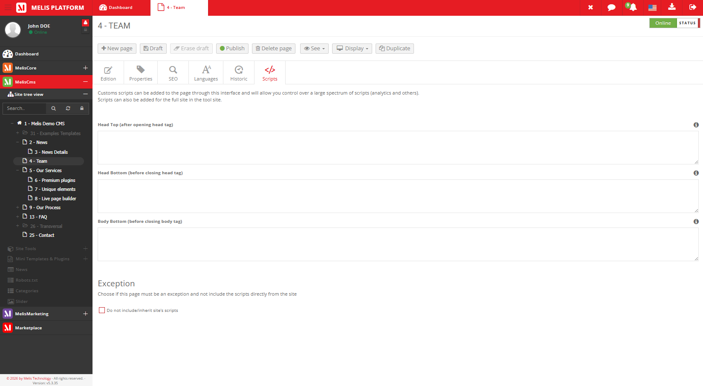
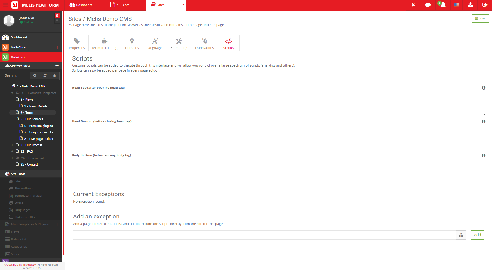

# MelisCmsPageScriptEditor Module — Functional Documentation (for AI)

> **Purpose of this document**: describe, functionally and technically, the
> `melisplatform/melis-cms-page-script-editor` module, so that an AI (or a developer) can
> understand *what the module does*, *which tools it provides*, *how they work* and
> *where the corresponding code lives*.
>
> **Audience**: consumed by the **MelisAI** module (a MelisPlatform module that exposes an
> MCP function to answer user questions). MelisAI fetches this `.md` file and the
> screenshots in `./images/` **on demand** — so the doc is self-contained and §9 acts as
> the filename→content index for retrieving a specific screenshot.
>
> **Status**: reviewed 2026-06-08 against the current source. The module carries no
> semantic version (no `version` in `composer.json`), so treat this doc as describing the
> current `melisplatform/melis-cms-page-script-editor` source rather than a tagged release.
>
> Screenshots live in `./images/` (relative paths `./images/...`).

---

## 1. Overview

`MelisCmsPageScriptEditor` lets users **add custom scripts and styles at the site and page
levels** — e.g. analytics tags, tracking pixels, third-party widgets, custom `<style>` or
`<script>` blocks — and have them **injected automatically into the rendered front-office
HTML** at chosen positions (after `<head>`, before `</head>`, or before `</body>`). It adds
a **Scripts** tab to the CMS page editor and to the Site tool, and resolves the effective
scripts per page at render time (site + page, with a per-page opt-out).

| Item | Value |
|---|---|
| Package name | `melisplatform/melis-cms-page-script-editor` |
| Type | `melisplatform-module` |
| PHP namespace | `MelisCmsPageScriptEditor\` → `src/` (PSR-4) |
| Melis category | `cms` |
| License | OSL-3.0 (per `composer.json`) |
| PHP required | `^8.1 | ^8.3` |
| Framework | Laminas (ex-Zend Framework 2/3), Melis MVC architecture |
| dbdeploy | `true` (DB migrations applied automatically) |

> **License note**: `composer.json` declares **OSL-3.0**, while `README.md` references the
> *Melis Technology premium EULA*. The package metadata (OSL-3.0) is taken as authoritative
> here; flag the discrepancy to a human if licensing matters.

### Dependencies (required Melis modules)

Declared in `composer.json`:

- `melisplatform/melis-core` (`^5.2`) — foundation, services, events, rights, translations
- `melisplatform/melis-cms` (`^5.2`) — CMS, pages, sites, the page editor & site tool it hooks into

> The `README.md` additionally lists `melis-engine` and `melis-front` as prerequisites
> (used at render time); they come in through the standard Melis platform install.

### Activation per site (important)

The module is **not active on a site by default**. To have the defined scripts rendered on
a site's front-office, it must be **manually enabled on that site**: *MelisCms → Site Tools
→ Sites → select a site → "Module Loading" tab → activate `MelisCmsPageScriptEditor`*.
Until then, the back-office Scripts tabs can be edited but nothing is injected on the front.

---

## 2. Functional concepts

- **Script set**: per **site** and/or per **page**, three free-text slots are stored and
  injected at distinct positions of the rendered HTML:
  - **Head top** (`mcs_head_top`) — right **after the opening `<head>`** tag
  - **Head bottom** (`mcs_head_bottom`) — right **before the closing `</head>`** tag
  - **Body bottom** (`mcs_body_bottom`) — right **before the closing `</body>`** tag
- **Site vs page scope**: scripts can be defined at the **site** level (apply to every page
  of the site) and/or at the **page** level (apply to that page only).
- **Composition at render**: for a given page, the effective output is **site scripts first,
  then page scripts** (each slot concatenated in that order).
- **Exception (per-page opt-out)**: a page can **exclude the site's scripts**, in which case
  only that page's own scripts are injected. The set of pages opting out is the **exceptions
  list**, manageable from the Site tool.

### Data model (MySQL tables)

| Table | Role | Primary key |
|---|---|---|
| `melis_cms_scripts` | A script set for a site and/or page (`mcs_site_id`, `mcs_page_id`, `mcs_head_top`, `mcs_head_bottom`, `mcs_body_bottom`, edition date, user) | `mcs_id` |
| `melis_cms_scripts_exceptions` | A page that **excludes** its site's scripts (`mcse_site_id`, `mcse_page_id`, creation date, user) | `mcse_id` |

- MySQL Workbench model: `install/sql/Model/MelisCmsPageScriptEditor.mwb`
- Base structure: `install/sql/setup_structure.sql`
- Incremental migrations: `install/dbdeploy/*.sql` (install)

---

## 3. Tools and elements provided

The module exposes:

1. **A "Scripts" tab in the CMS page editor** (page-level scripts + exclude-site toggle)
2. **A "Scripts" tab in the Site tool** (site-level scripts + the exceptions list)
3. **An application service** to read/write scripts and resolve the effective set
4. **A view helper** + **listeners** that persist and inject the scripts

> **Two Scripts tabs, two different scopes.** The module adds a Scripts tab in *both* the
> page editor and the Site tool, and although they share the same script fields they are
> **not the same view**:
> - **Page editor tab** — edits **this page's** scripts and shows a single **"exclude site
>   scripts"** checkbox: from a page you only control whether **the current page** is an
>   exception.
> - **Site tool tab** — edits the **whole site's** scripts and shows the **full exceptions
>   list**: every page of the site that excludes the site scripts, which you can manage
>   (add/remove) from here.

---

### 3.1 "Scripts" tab — CMS page editor (page level)

Injected into the CMS page edition tabs (declared in `config/app.toolstree.php`, key
`meliscmspagescripteditor_page_edition`, icon `glyphicons embed_close`).

- **Controller**: `src/Controller/MelisCmsPageScriptEditorPageEditionController.php`
  (`renderPageScriptEditorAction`, `renderPageScriptEditorLaunchFormAction`,
  `saveScriptAction`)
- **Views**: `view/melis-cms-page-script-editor/melis-cms-page-script-editor-page-edition/*.phtml`
- **Form**: `meliscmspagescripteditor_script_form` (`config/app.tools.php`) — three
  textareas: `mcs_head_top`, `mcs_head_bottom`, `mcs_body_bottom`
- **Exclude form**: `meliscmspagescripteditor_script_exception_form` — a single
  `mcse_exclude_site_scripts` checkbox (opt the page out of the site's scripts)

On the page editor's **Scripts** tab the user enters the page's head-top / head-bottom /
body-bottom scripts and optionally ticks **"exclude site scripts"**. From a page you can
**only see and set whether *this* page is an exception** — there is no list of other pages
here; the site-wide exceptions list lives in the Site tool tab (§3.2). The values are saved
together with the page (see the SavePage listener, §4) — not through a separate save button.


*Caption: the page editor's Scripts tab — three textareas (head top, head bottom, body
bottom) and the "exclude site scripts" checkbox that makes the page ignore site-level scripts.*

---

### 3.2 "Scripts" tab — Site tool (site level + exceptions)

Injected into the Site tool's edit-site tabs (declared in `config/app.toolstree.php`, keys
`meliscmssitetoolscripteditor` / `meliscms_tool_sites_scripts`).

- **Controller**: `src/Controller/MelisCmsPageScriptEditorToolSiteEditionController.php`
  (`renderToolSiteScriptsAction`, `renderToolSiteScriptContentAction`, `saveSiteScriptAction`,
  `renderScriptExceptionsAction`, `getScriptExceptionsAction`, `saveSiteScriptExceptionAction`,
  `renderTableActionDeleteExceptionAction`)
- **Views**: `view/melis-cms-page-script-editor/melis-cms-page-script-editor-tool-site-edition/*.phtml`
- **Form**: the same `meliscmspagescripteditor_script_form` (head-top / head-bottom /
  body-bottom), here applied to the **whole site**
- **Exceptions table** (`config/app.tools.php`, key
  `meliscmspagescripteditor_site_script_exceptions`): the **site-wide** view of exceptions —
  a DataTable listing **every page of the site that excludes the site's scripts** (something
  you cannot see from an individual page). Columns: exception id (`mcse_id`, hidden), page id
  (`mcse_page_id`), page name — with a **delete** action
  (`render-table-action-delete-exception`) to remove a page from the exception list (put it
  back under the site's scripts). Data loads via AJAX from
  `/melis/MelisCmsPageScriptEditor/MelisCmsPageScriptEditorToolSiteEdition/getScriptExceptions`.
- **Add an exception**: `meliscmspagescripteditor_tool_site_exception_form`
  (`tool_site_mcse_page_id`) lets a user add a page to the exception list from the Site tool.

Site scripts are saved with the site (see the SaveSiteScript listener, §4).


*Caption: the Site tool's Scripts tab — the site-wide head-top / head-bottom / body-bottom
script fields plus the site-wide exceptions table (every page opting out of the site's
scripts), with add/delete. Unlike the page tab, this shows all exceptions across the site.*

---

### 3.3 Application service `MelisCmsPageScriptEditorService`

- **File**: `src/Service/MelisCmsPageScriptEditorService.php`
- **Service manager alias**: `MelisCmsPageScriptEditorService`

Retrieval and usage from another module:

```php
$scriptService = $this->getServiceManager()->get('MelisCmsPageScriptEditorService');

// Resolve the effective scripts to render for a page (site + page, honoring exclusions)
$resultList = $scriptService->getMixedScriptsPerPage($pageId);
```

Main public methods:

| Method | Role |
|---|---|
| `addScript($siteId, $pageId, $headTopScript, $headBottomScript, $bodyBottomScript, $mcs_id = null)` | Create/update a script set for a site and/or page |
| `addScriptException($siteId, $pageId)` | Mark a page as excluding its site's scripts |
| `getScriptExceptions($siteId, $sortColumn, $sortOrder)` | List the site's exception pages |
| `getScriptsPerSite($siteId)` | The site-level script set |
| `getScriptsPerPage($pageId)` | The page-level script set |
| `getScriptsExceptionPerPage($pageId)` | Whether/how a page excludes site scripts |
| `getMixedScriptsPerPage($pageId)` | **The effective, render-ready scripts** for a page (site + page, applying exclusions; site first) |
| `updatePageScripts($idPage, $contentGenerated)` | Persist generated page-script content |
| `getSiteId($pageId)` | Resolve the site id of a page |

#### Tables (Table Gateways)

Declared as aliases in `config/module.config.php`: `MelisCmsScriptTable`
(→ `melis_cms_scripts`) and `MelisCmsScriptExceptionTable`
(→ `melis_cms_scripts_exceptions`, with `getScriptExceptions(...)`), in `src/Model/Tables/`.

---

### 3.4 View helper

- `melisCmsPageScriptEditorAddScript` — `src/View/Helper/MelisCmsPageScriptEditorAddScriptHelper.php`
  (`addScriptData($serviceManager, $scriptData, $siteId, $pageId)`) — helper used to inject
  the resolved script data into a rendered view.

---

## 4. Listeners (`src/Listener/`)

Registered in `src/Module.php` (`onBootstrap`). The split is by URI: back-office (`/melis`)
attaches the save/duplicate listeners; the front (any other URI) attaches the render
injector.

| Listener | Trigger | Role |
|---|---|---|
| `MelisCmsPageScriptEditorSavePageListener` | Page **save / publish** (back-office) | Persists the page's script set and its exclude-site exception config |
| `MelisCmsPageScriptEditorSaveSiteScriptListener` | Site **save** (back-office) | Persists the site's script set and exception config |
| `MelisCmsPageScriptEditorDuplicatePageListener` | Page **duplicate** (back-office) | Copies the source page's scripts onto the duplicated page |
| `MelisCmsPageScriptEditorScriptTagListener` | Page **render** (front) | Injects the effective scripts into the HTML — head-top after `<head>`, head-bottom before `</head>`, body-bottom before `</body>`. If the page excludes site scripts, only the page's scripts are injected; otherwise **site scripts first, then page scripts**. |

---

## 5. Front assets

Declared in `config/app.interface.php` (key `ressources`):

- **JS**: `public/js/tool.js`
- **CSS**: `public/css/custom.css`
- **Compiled bundle**: `public/build/css/bundle.css`, `public/build/js/bundle.js`

---

## 6. Internationalization

- Translation files: `language/en_EN.interface.php`, `language/fr_FR.interface.php`
- Interface keys use the `tr_meliscmspagescripteditor_*` prefix.
- Translation loading: `Module::createTranslations()` (defaults to `en_EN`).

---

## 7. Quick code map

```
melis-cms-page-script-editor/
├── composer.json                 → module dependencies & metadata (dbdeploy: true)
├── config/
│   ├── module.config.php         → routes, service, tables, view helper, controllers
│   ├── app.toolstree.php         → injects the Scripts tab into the page editor and Site tool
│   ├── app.interface.php         → module resources (JS/CSS, bundle)
│   └── app.tools.php             → forms (script form, exclude form, add-exception) + exceptions DataTable
├── src/
│   ├── Module.php                → bootstrap, listener wiring (back-office vs front), translations
│   ├── Controller/               → PageEdition, ToolSiteEdition
│   ├── Service/                  → MelisCmsPageScriptEditorService
│   ├── Model/Tables/             → MelisCmsScriptTable, MelisCmsScriptExceptionTable
│   ├── Listener/                 → SavePage, SaveSiteScript, DuplicatePage, ScriptTag
│   └── View/Helper/              → MelisCmsPageScriptEditorAddScriptHelper
├── view/                         → .phtml templates (page-edition + tool-site-edition)
├── public/                       → JS/CSS assets + bundles
├── language/                     → en_EN / fr_FR translations
├── install/                      → SQL (structure, MWB model, dbdeploy migration)
└── etc/                          → MarketPlace (images/xml) + MelisAI/doc (this doc)
```

---

## 8. Typical script lifecycle

1. **Activate** the module on the target site (*Site Tools → Sites → Module Loading*).
2. **Site scripts**: in the Site tool's **Scripts** tab, enter head-top / head-bottom /
   body-bottom scripts for the whole site → saved with the site (SaveSiteScript listener).
3. **Page scripts**: in the page editor's **Scripts** tab, optionally add page-specific
   scripts and/or tick **exclude site scripts** → saved on page save/publish (SavePage
   listener).
4. **Exceptions**: manage the list of pages that exclude the site's scripts from the Site
   tool (add/remove).
5. **Render**: when a front page is served, the ScriptTag listener resolves the effective
   scripts (`getMixedScriptsPerPage`) and injects them — head-top after `<head>`,
   head-bottom before `</head>`, body-bottom before `</body>`; site scripts first unless the
   page opted out.
6. **Duplicate**: duplicating a page copies its scripts to the new page (DuplicatePage
   listener).

---

## 9. Screenshot index (for on-demand retrieval)

All screenshots live in `./images/` (i.e. `/etc/MelisAI/doc/images/`). This table is the
**filename → content** index the MelisAI MCP uses to fetch a specific screenshot on demand;
each row's caption in the body gives the text-only description of what the image shows.

| Image file | Content |
|---|---|
| `meliscmspagescripteditor-page-tab-scripts.png` | Scripts tab in the CMS page editor (head-top/bottom, body-bottom, exclude-site checkbox) |
| `meliscmspagescripteditor-tooloverride-sites-edit-tab-scripts.png` | Scripts tab in the Site tool (site-level scripts + full exceptions list) |

---

*Document for AI consumption (MelisAI MCP) — describes the
`melisplatform/melis-cms-page-script-editor` module. Last reviewed 2026-06-08 against the
current source.*
